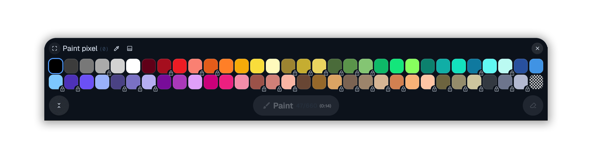

## wplace-darkmode

[](https://github.com/z1xus/wplace-darkmode/releases)
[](https://github.com/z1xus/wplace-darkmode/issues)
[](https://github.com/z1xus/wplace-darkmode/pulls)

Userscript that applies a tasteful dark theme to `wplace.live` with a switch.



### Usage

1. Install a userscript manager (e.g. [Tampermonkey](https://www.tampermonkey.net/), [Violentmonkey](https://violentmonkey.github.io/)).
2. Install the latest `.user.js` from the [Releases](https://github.com/z1xus/wplace-darkmode/releases) page.
3. Visit `https://wplace.live` — the script loads automatically.
4. Use the round toggle button in the top-left controls to switch dark/light.

### Building

```bash
bun run build
```

### License

MIT — see [LICENSE](LICENSE).
